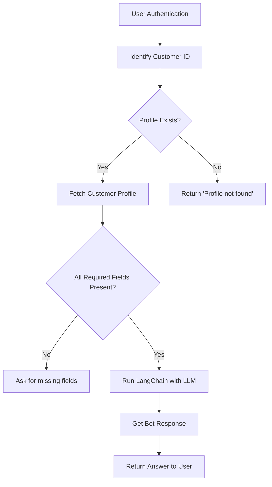

# Mortgage Eligibility Checker

This is an LLM based mortgage assistant chatbot designed to provide preliminary eligibility assessments based on a user's financial profile.

## The Tech Stack Used:
- FastAPI for backend logic and secure routing

- LangChain + Ollama (LLaMA 3) for natural language reasoning

- HTTP Basic Authentication to protect user data

- Streamlit (optional) for a simple, interactive frontend

- JSON-based mock databases for user and profile management

## What It Does:
- Checks mortgage eligibility based on:

  - ✅ Age (must be ≥ 21)

  - ✅ Credit Score (must be ≥ 700)

  - ✅ Annual Income (must be ≥ 50,000)

- Gives preliminary, non-committal assessments — never promises approval

- Handles both self-checks and third-party (via customer ID) assessments
- Uses soft guardrails to prevent financial disclosure or misuse


## What to be fixed:
Gracefully handling customer's vague or unrelated questions.


## Mortgage Bot Workflow


## How to run the code:

### Backend:
In the terminal:
```
cd bot
fastapi dev main.py
```

### Frontend:
Open another terminal:
```
streamlit run app.py
```
 

## Users Conversations

#### For John Doe


#### For Jane Smith


#### For Evelyn Goods


